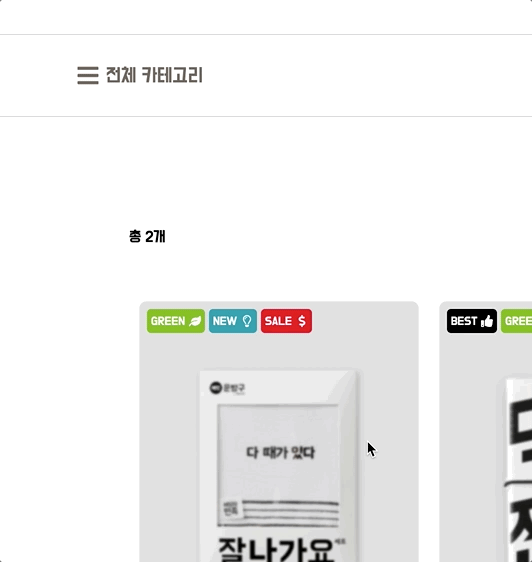

<h1 align="center">
  배민 문방구 5팀, 건강한 형제들
</h1>

<h2 align="center">
  📆 2021.08.09 ~ 2021.08.31
</h2>

---

## [서비스를 이곳에서 만나보세요!](http://13.125.153.143:8080/)

[](http://13.125.153.143:8080/)

## 기술 스택


## Getting Started

```bash
cd frontend/client
// .env 생성하기
npm install
npm run build

cd ../admin
npm install
npm run build

cd ../../backend
// .env 생성하기
npm install
npm run build

mkdir -p public
cp -r ../frontend/client/dist/* ./public/
cp -r ../frontend/admin/dist/*  ./public/
node ./dist/bundle.js
```

### 환경설정 파일 양식

```json
FE `dotenv` template

OAUTH_GITHUB_SIGN_URL=

BE `dotenv` template

DATABASE_NAME=
DATABASE_HOST=
DATABASE_PORT=
DATABASE_USERNAME=
DATABASE_PASSWORD=
OAUTH_GITHUB_TOKEN_URL=
OAUTH_GITHUB_PROFILE_URL=
SERVER_PORT=
ORIGIN_URL=
SESSION_SECRET=
COOKIE_DOMAIN=
AWS_S3_BUCKET_NAME=
AWS_S3_ACCESS_KEY_ID=
AWS_S3_SECRET_ACCESS_KEY=
AWS_S3_REGION=
AWS_S3_UPLOAD_FILE_URL=
```

### 프로젝트 디렉토리 구조

```
/frontend
 └──/admin
     ├── /node_modules
     ├── /public
     └── /src
          ├── /apis
          ├── /assets
          ├── /components
          ├── /assets
          ├── /constatns
          ├── /hooks
          ├── /lib
          ├── /pages
          ├── /portal
          ├── /styles
          ├── /theme
          ├── /types
          ├── /utils
          ├── App.tsx
          ├── index.css
          └── index.tsx
/frontend
 └──/client
     ├── /node_modules
     ├── /public
     └── /src
          ├── /apis
          ├── /assets
          ├── /components
          ├── /constatns
          ├── /hooks
          ├── /lib
          ├── /pages
          ├── /portal
          ├── /recoil
          ├── /theme
          ├── /types
          ├── /utils
          ├── App.tsx
          ├── GlobalyStyle.ts
          └── index.tsx
/backend
 ├── /node_modules
 └── /src
      ├── /config
      ├── /constants
      ├── /controller
      ├── /errors
      ├── /middlewares
      ├── /repository
      ├── /router
      ├── /service
      ├── /types
      ├── /utils
      ├── database.ts
      └── server.ts
/scripts
```

### package 명령어

```json
// frontend
"scripts": {
  "dev": "webpack serve --config webpack.dev.js --progress", // 개발용 서버 실행
  "build": "webpack --config webpack.prod.js", // 웹팩 번들링 실행
  "build:dev": "webpack --config webpack.dev.js", // 개발용 웹팩 번들링 실행
  "test": "jest", // 테스트 코드 실행
  "test:coverage": "jest --coverage" // 테스트 커버리지 실행
}

// backend
"scripts": {
  "dev": "nodemon --watch 'src/**/*.ts' --exec ts-node src/server.ts", // 개발용 서버 실행
  "build": "webpack --config ./webpack.config.js" // 웹팩 번들링 실행
}
```

## 주요 기능

| 📚 Smart Layer                               | 설명                                                                                                                                                                                     |
| -------------------------------------------- | ---------------------------------------------------------------------------------------------------------------------------------------------------------------------------------------- |
|  | - 상위 카테고리와 하위 카테고리를 렌더링하고 선택할 수 있습니다. <br> - 하위 카테고리로 이동하는 중에 의도하지 않은 마우스 호버가 되지 않도록 **디바운스**를 사용해 UX를 향상시켰습니다. |

| 📕 Promotion Section                   | 설명                                                                                                                              |
| -------------------------------------- | --------------------------------------------------------------------------------------------------------------------------------- |
|  | - **react-slick**을 활용해 프로모션 캐로셀을 제공합니다. <br> - 연결된 상품으로 이동할 수 있으며 프로모션 조회 수를 증가시킵니다. |

| 📗 상품 검색                              | 설명                                                                                                                                                                      |
| ----------------------------------------- | ------------------------------------------------------------------------------------------------------------------------------------------------------------------------- |
|  | - 문방구 내 상품을 키워드를 통해 검색할 수 있습니다. <br> - **디바운스**를 적용해 잦은 API 요청을 막았습니다. <br> - **Local Storage**를 이용해 최근 검색어를 저장합니다. |

| 📘 최근 본 상품 리스트                       | 설명                                                                                                                  |
| -------------------------------------------- | --------------------------------------------------------------------------------------------------------------------- |
|  | - 최근 조회한 상품 목록을 조회할 수 있습니다. <br> - **LocalStorage**와 **Recoil**을 이용해서 최근 상품을 관리합니다. |

| 📙 상품 상세보기                          | 설명                                                                                                                              |
| ----------------------------------------- | --------------------------------------------------------------------------------------------------------------------------------- |
|  | - 상품 이미지에 마우스를 호버할 시 줌이 가능하도록 하였습니다. <br/> - 결제금액에 애니메이션을 적용해 신선한 **UX**를 제공합니다. |

| 📕 사장실 대시보드                       | 설명                                                                                                                                                                                          |
| ---------------------------------------- | --------------------------------------------------------------------------------------------------------------------------------------------------------------------------------------------- |
|  | - 우아한 사장실의 대문입니다. <br> - 전체 상품의 카테고리 비율, 카테고리 별 조회수 등의 정보를 한눈에 조회할 수 있습니다. <br> - 주기적인 풀링으로 **실시간** 주문 현황을 조회할 수 있습니다. |

| 📗 사장실 프로모션 관리                  | 설명                                                                                                     |
| ---------------------------------------- | -------------------------------------------------------------------------------------------------------- |
|  | - 상품 홍보용 **프로모션**을 등록하고 조회할 수 있습니다. <br> - 프로모션의 조회수를 확인할 수 있습니다. |

## 팀원

<table>
    <tr>
        <th width="25%" align="center">:spider_web: FULL-STACK 
        </th>
        <th width="25%" align="center">:spider_web: FULL-STACK 
        </th>
        <th width="25%" align="center">:spider_web: FULL-STACK 
        </th>
        <th width="25%" align="center">:spider_web: FULL-STACK 
        </th>
    </tr>
    <tr>
        <td align="center">
        
        </td>
        <td align="center">
        
        </td>
        <td align="center">
        
        </td>
        <td align="center">
        
        </td>
    </tr>
    <tr>
        <td align="center">
        <a href="https://github.com/kowoohyuk">고우혁</a>
        </td>
        <td align="center">
        <a href="https://github.com/Kwongiseok">권기석</a>
        </td>
        <td align="center">
        <a href="https://github.com/peanut-lover">손지호</a>
        </td>
        <td align="center">
        <a href="https://github.com/ondal1997">신어진</a>
        </td>
    </tr>
    <tr>
        <td align="center">최근들어 러닝을 취미로 삼으려고 노력하고 있습니다! :) 혹시 NRC 사용하시는 분들이 계시다면 kowoohyuk91@gmail.com 친구 추가 부탁드려요!
        </td>
        <td align="center">프론트엔드 개발이 재밌네요 
        </td>
        <td align="center">What does not destroy me, makes me stronger. - Friedrich Nietzsche
        </td>
        <td align="center">인생은 자전거를 타는 것과 같다. 균형을 잡으려면 움직여야 한다. - 아인슈타인
        </td>
    </tr>
</table>
